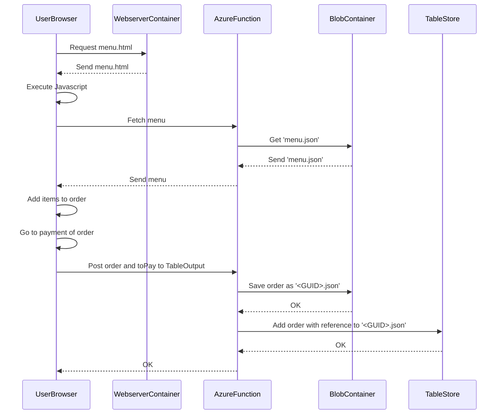
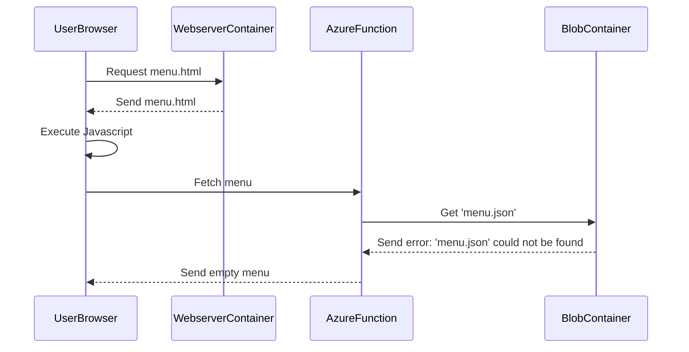

# BootcampWebsite

## What is it?
In this project we make a website which simulates an online food ordering system, in which you can choose from a selection of dishes on a menu. Once the order is complete, the program shows the total amount that has to be paid.

## Execution
The front-end of this project is a website, which can be accessed [here](https://stefsite.z13.web.core.windows.net/).

## Flow diagrams
In the flow diagrams below you can see the flow of information and commands between the different components in this project in the order in which they are executed.

The first flow is a happy flow, where everything goes as intended.
The second flow is a sad flow, where the menu could not be found in the BlobContainer.

